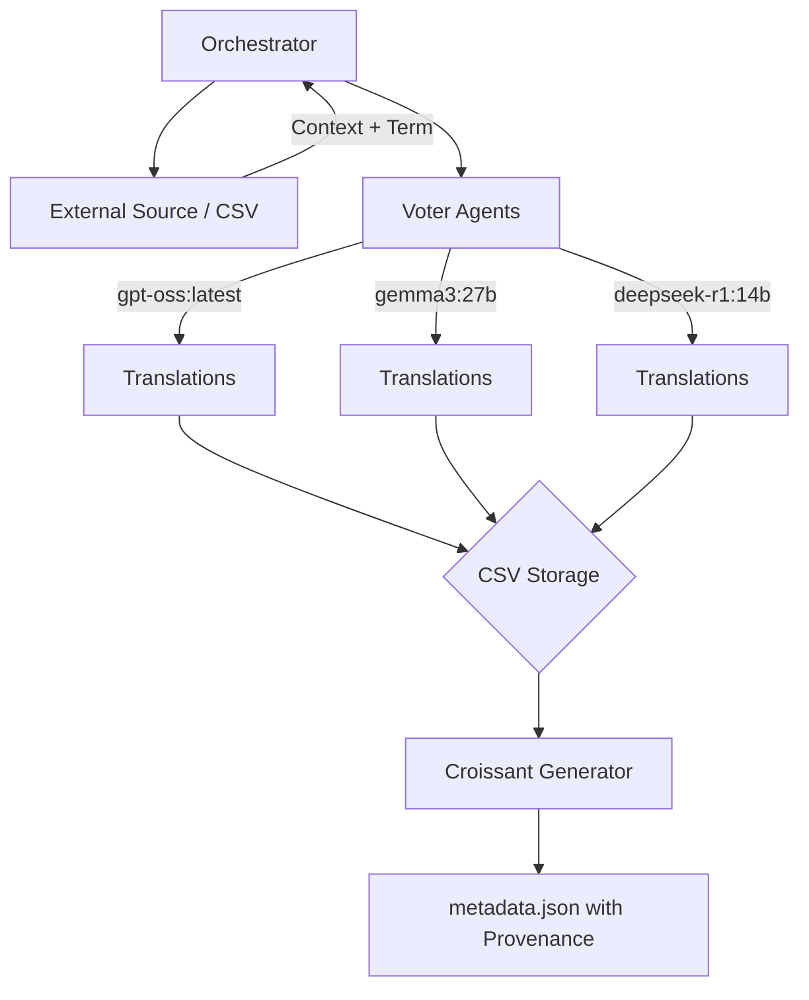

# Agent Architecture and Prompts

This document outlines the agent-based architecture used for the Multilingual Controlled Vocabulary project and provides the exact prompts required to recreate the pipeline.

## System Architecture

The project uses an **Orchestrator** script that coordinates two main types of agents in a multi-model translation pipeline:

1.  **Voter Agent**: A specialized technical translator that generates candidate translations for a term in multiple languages, using a "Scope Note" for context.
2.  **Arbitrator Agent** (Optional framework): A high-level agent capable of selecting the best candidate or synthesizing a consensus when multiple models provide conflicting translations.



## Agent Prompts

### 1. Voter Agent Prompt
This prompt is used to generate translations. It expects `{{target_languages}}`, `{{term}}`, and `{{scope_note}}` as variables.

```markdown
You are a highly specialized technical translator agent.
Your task is to translate the given technical term from English into the target language.

**Context:**
The term is part of a Controlled Vocabulary for Machine Learning and AI.
A "Scope Note" will be provided to give you the exact context of the term.

**Instructions:**
1. Analyze the provided "Scope Note".
2. Translate the term into the following languages: **{{target_languages}}**.
3. Output ONLY valid JSON where keys are the language codes (e.g. "fr", "es", "de").
4. Do not include markdown formatting.

**Input:**
- Term: {{term}}
- Scope Note: {{scope_note}}

**Output JSON:**
{
  "fr": {
    "translation": "...",
    "confidence_score": 0.95
  },
  "es": {
    "translation": "...",
    "confidence_score": 0.98
  }
}
```

### 2. Arbitrator Agent Prompt
Used for consensus and validation across candidates. It expects `{{term}}`, `{{scope_note}}`, and `{{candidates}}` (a JSON dump of results).

```markdown
You are the **Arbitrator Agent**.
You have received translations from multiple sources (or just one verified source) for a technical term.
Your job is to select the BEST translation or synthesize a better one if all are flawed.

**Source Term:** {{term}}
**Scope Note:** {{scope_note}}

**Candidates:**
{{candidates}}

**Instructions:**
1. Review the candidates and their confidence scores.
2. Select the winning translation.
3. If the consensus is weak (different translations), use your reasoning capabilities to decide the most accurate technical term.
4. Assign a final confidence score.

**Output Format (JSON):**
```json
{
  "selected_translation": "...",
  "reasoning": "...",
  "final_confidence_score": 0.98,
  "winning_model": "Gemini 3 Flash",
  "rai_flags": []
}
```
```

## Technical Implementation Notes

*   **Models Supported**: `gpt-oss:latest`, `gemma3:27b`, `deepseek-r1:14b`.
*   **Infrastructure**: Calls are made via the Ollama API.
*   **Provenance**: The `winning_model` column in the final CSV tracks which model generated which row. In the Croissant metadata, this is formally linked via `@id` to the `creator` section.
*   **Multilingual Metadata**: The dataset name includes translations for the primary term in all languages, with each entry linked to its generating model.
