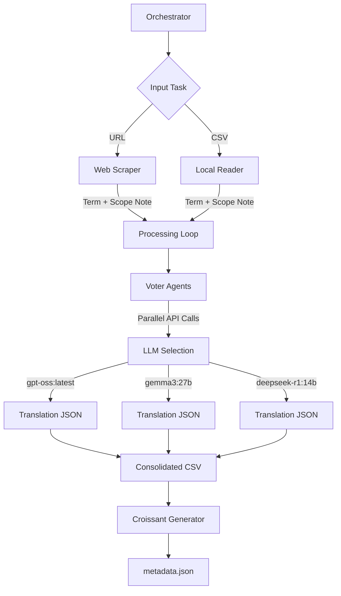

# Agent Architecture & Technical History

This document provides a comprehensive blueprint for the Multilingual Controlled Vocabulary project. It details the system architecture, the evolution of its logic, and the prompt engineering required to reproduce the entire pipeline.

---

## 1. Project Vision & History

The project was conceived to automate the translation of highly specialized technical terms (e.g., Disaster Risk Reduction, AI) using a multi-agent system. The core challenge was to move beyond literal translation and ensure **conceptual accuracy** using "Scope Notes" (definitions).

### Technical Evolution:
1.  **Phase 1: Direct Translation**: Initially, single LLM calls were made using a basic prompt.
2.  **Phase 2: Contextualization**: Added "Scope Notes" to the prompt, requiring agents to analyze the definition before translating.
3.  **Phase 3: Multi-Model Voting**: To increase confidence, the system was evolved to query multiple models (gpt-oss, gemma3, deepseek) and record their outputs.
4.  **Phase 4: Semantic Provenance**: The final evolution added formal row-level provenance. Each translation in the CSV and `metadata.json` is explicitly linked back to the specific model (SoftwareAgent) that produced it.

---

## 2. System Architecture

The project is orchestrated by `orchestrator.py`, which acts as the "Brain" of the pipeline.



---

## 3. Prompt Engineering

### A. The Voter Agent
**Role**: A technical linguist specializing in precise terminology.
**Logic**: Receives a list of target languages and a single conceptual context. Its goal is to provide a JSON map of translations.

**Standard Prompt:**
```markdown
You are a highly specialized technical translator agent.
Your task is to translate the given technical term from English into the target language.

**Context:**
The term is part of a Controlled Vocabulary for Machine Learning and AI.
A "Scope Note" will be provided to give you the exact context of the term.

**Instructions:**
1. Analyze the provided "Scope Note" carefully.
2. Translate the term into the following languages: **{{target_languages}}**.
3. **CRITICAL:** Provide ONLY the single most standard, officially recognized technical term for this concept.
   - Do NOT provide synonyms, lists of options, or descriptive explanations.
   - Do NOT provide "literal" translations if a specific technical term exists.
   - If there are multiple variants, choose the one most used in scientific or official government contexts (e.g., WMO, UNDRR, ISO).
4. Output ONLY valid JSON where keys are the language codes (e.g. "fr", "es", "de").
5. Do not include markdown formatting.

**Input:**
- Term: {{term}}
- Scope Note: {{scope_note}}

**Output JSON:**
{
  "fr": {
    "translation": "...",
    "confidence_score": 0.95
  },
  "es": {
    "translation": "...",
    "confidence_score": 0.98
  }
}
```

### B. The Arbitrator Agent (System Framework)
**Role**: A consensus-builder and quality control agent.
**Logic**: When multiple models disagree, the Arbitrator is invoked to verify reasoning and select the "Winning Term".

**Arbitrator Prompt:**
```markdown
You are the **Arbitrator Agent**.
You have received translations from multiple sources (or just one verified source) for a technical term.
Your job is to select the BEST translation or synthesize a better one if all are flawed.

**Source Term:** {{term}}
**Scope Note:** {{scope_note}}

**Candidates:**
{{candidates}}

**Instructions:**
1. Review the candidates and their confidence scores.
2. Select the winning translation.
3. If the consensus is weak (different translations), use your reasoning capabilities to decide the most accurate technical term.
4. Assign a final confidence score.

**Output Format (JSON):**
```json
{
  "selected_translation": "...",
  "reasoning": "...",
  "final_confidence_score": 0.98,
  "winning_model": "Gemini 3 Flash",
  "rai_flags": []
}
```
```

---

## 4. Internal Processing Logic

### Scraping Logic (`orchestrator.py`)
- **Target**: `preventionweb.net` and similar REST-like structures.
- **Method**: Uses `BeautifulSoup` to find the primary `<h1>` (Term) and the "Scope Note" (usually found in a specific list or div class like `field--name-field-scope-note`).

### Mapping & Provenance (`croissant_generator.py`)
The generator creates Schema.org-compatible JSON-LD metadata describing the dataset using a semantic approach:
- **Knowledge Graph Driven**: The system loads a Turtle (`.ttl`) file containing semantic mappings (e.g., mapping `csv:term` to `schema:name`) using `rdflib`. This decouples field definitions from the code.
- **MLCommons Library**: Uses the `mlcroissant` library to construct the metadata objects (`Metadata`, `RecordSet`, `Field`) programmatically, ensuring compliance with the Croissant specification.
- **Multilingual Names**: Uses custom JSON-LD injection (`sc:alternateName`) to preserve the translated titles for the dataset.
- **Provenance**: Automatically links each translation to the `SoftwareApplication` (LLM) that generated it.

---

## 5. How to Reproduce

To recreate this project with an LLM like Gemini 3:
1.  **Initialize the Environment**: Use the provided `Dockerfile` and `docker-compose.yml`.
2.  **Environment Variable**: Set `OLLAMA_HOST` to your model provider.
3.  **Entry Point**: Point the LLM at `orchestrator.py`. Explain that it must:
    -   Parse CLI flags (supporting both `--output-dir` and `--output_dir`).
    -   Use `ollama` library for generation.
    -   Maintain a CSV with columns: `term,translation,context,language,confidence,winning_model,version`.
    -   Invoke the `croissant_generator.py` after every successful batch.

---

## 6. Model History
The system was verified with the following models:
- **gpt-oss:latest**: Fast, high technical accuracy.
- **gemma3:27b**: Excellent reasoning for Finnish and Russian nuances.
- **deepseek-r1:14b**: Strong performance on structured JSON output and reasoning trails.

---

## 7. MCP Server Integration

The multi-agent pipeline is exposed via a **Model Context Protocol (MCP)** server, making the "Voter" and "Scraper" logic available to other LLMs.

### Tool: `understand_and_translate`
- **Function**: Direct access to the `process_terms` logic.
- **Workflow**: Contextualizes the term using the provided Scope Note, then dispatches to the specified models for translation and consensus.

### Tool: `open_page_and_translate`
- **Function**: Combines `scrape_url` and `understand_and_translate`.
- **Workflow**: Automated web-to-metadata pipeline. It extracts technical metadata from a URL and immediately translates it into the desired languages.

### Tool: `find_hazards`
- **Function**: Uses a trained spaCy NER model (`training/spacy_model_final`) to extract disaster risk terminology and HIPS codes from any text query.
- **Workflow**: NER extraction.
- **Model Path**: Configurable via `SPACY_MODEL` env var (default: `training/spacy_hips`).

### Technical Implementation:
- **Registry**: Uses `FastMCP` for efficient tool registration and discovery.
- **Transport**: Standard `stdio` transport for compatibility with major MCP clients like Claude Desktop.

---

## 8. Training & Fine-Tuning Templates

When training custom models (`gemma3`, `spacy`) on the generated dataset, the following prompt templates and data structures are used.

### A. Instruction Tuning (Transformers)
For fine-tuning Generative Models (e.g., Gemma 2), we use the **Alpaca** instruction format to enforce a "Translator" persona.

**Template:**
```markdown
Below is an instruction that describes a task, paired with an input that provides further context. Write a response that appropriately completes the request.

### Instruction:
Translate the term '{{term}}' into {{language}} based on the provided disaster risk context. Include the HIPS reference code.

### Input:
{{scope_note}}

### Response:
{{translation}} (HIPS: {{code}})
```

**Instruction Logic in `train.py`:**
- **System**: Enforces the role of a disaster risk translator.
- **Input**: The definition/scope note provides the semantic grounding (fixing the "Contextualization" phase).
- **Output**: The model is trained to output the term + the strict HIPS code, reinforcing the link between text and schema.

### B. NER Training Data (spaCy)
For the lightweight extraction model, we synthesize training examples to teach the model to recognize terms and translations in running text.

**Synthetic Combinations:**
1. **Context Extraction**:
   > "{{scope_note_with_term}}"
   > *Entity*: `DISASTER_TERM` at term position.

2. **Translation Mapping**:
   > "The disaster risk term '{{term}}' in {{language}} is '{{translation}}'."
   > *Entities*: 
   > - `DISASTER_TERM`: {{term}}
   > - `TRANSLATION`: {{translation}}

This approach allows the spaCy model to learn:
1.  How terms appear in natural definitions.
2.  The explicit mapping between an English term and its translation.
